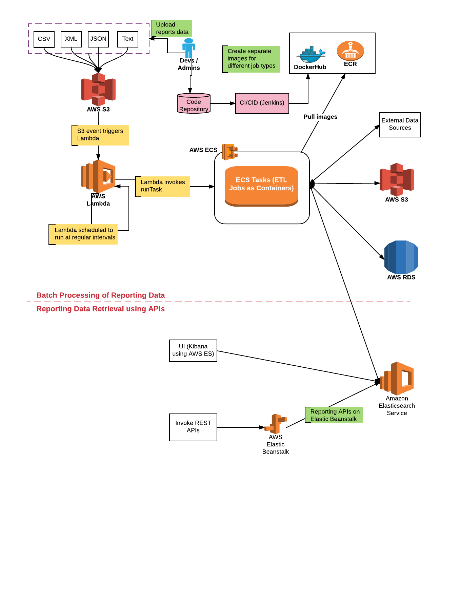

# Deep Dive into Creating Reporting Framework on AWS

The goal of this project is to create a custom reporting solution/framework using AWS services for fulfilling the requirement of creating Reporting Dashboard displaying multiple analytics reports representing data from different data sources. We have recently finished developing this solution while working in **[raksan consulting](https://www.raksan.in/)**.

The reporting solution/framework architecture is based on [ReportingDatabase](https://martinfowler.com/bliki/ReportingDatabase.html) design pattern recommended by [Martin Fowler](https://martinfowler.com/). As per the recommended design pattern, given the fact that transactional/operational database and reporting database fulfill different data requirements/needs, it would be good to have different databases for managing transactions and reporting data. 

Taking above into consideration, following represents key building blocks of **application architecture** of reporting solution/framework:

* ETL jobs to extract-transform-load data from different data sources to reporting database
* Containerized ETL jobs in order to make best use of cloud services 
* Schedule containerized ETL jobs using cloud services
* Reporting application that exposes reporting data through REST APIs
* Out-of-the-box analytics service such as ElasticSearch/Kibana 

Following represents technology architecture of the reporting framework:

Following represents key building blocks of **technology architecture**, as shown in the above diagram, which is dealt in detail in later sections:

* Spring Batch/Spring Data and Docker for Containerized ETL Jobs
* AWS services for reporting database (RDS, ElasticSearch)
* AWS services for scheduling/running reporting ETL jobs (AWS ECS)
* AWS services/Springboot for reporting application (AWS Elastic Beanstalk)
* Continuous delivery of reporting apps to AWS (BitBucket - Jenkins)

## Spring Batch/Spring Data and Docker for Containerized ETL Jobs

Following technologies are used to create containerized ETL jobs:

* Spring Batch for Batch jobs
* Spring Data for interacting with data sources such as MongoDB, ElasticSearch (ES), MySQL etc.
* Docker containers for containerizing ETL jobs

## AWS Services for Reporting Database

Following could be different AWS services which can be used for storing reporting data:

* AWS RDS with databases such as MYSQL
* AWS ElasticSearch (ES)
* AWS Redshift

We shall take into consideration both of the above AWS storage service for our reporting database. Details can be found on this page: [AWS Services for Reporting Database](https://github.com/eajitesh/Reporting-Solution-on-AWS/blob/master/aws_services_reporting_db.md)

## AWS Services for Scheduling/Running Reporting ETL Jobs

Following could be some of the different solution approaches which can be used to create reporting solution/framework using different AWS services: 

* AWS Batch/AWS Lambda 
* AWS ECS/AWS Lambda
* AWS EC2

Details can be found on this page: [AWS Services for Reporting ETL Jobs](https://github.com/eajitesh/Reporting-Solution-on-AWS/blob/master/aws_services_schedule_etljobs.md)

## Reporting Application using Springboot, AWS Services

Following is one of the solution approach for using creating and deploying reporting application on AWS:

* Using Springboot to create Reporting App
* Deploy reporting app on one of the following:
 * AWS ElasticBeanstalk
 * AWS EC2

Details can be found on this page: [Reporting Apps using Springboot, AWS Services](https://github.com/eajitesh/Reporting-Solution-on-AWS/blob/master/aws_services_reporting_apps.md)

## Continuous Delivery of Reporting Apps to AWS

Following is done to continuously deliver reporting app and containerized ETL jobs to AWS:

* Configure BitBucket Webhook for integration with Jenkins
* Configure Jenkins to integrate with BitBucket
* Configure Jenkins to build, test the app, build docker images, push docker images to AWS ECR/Dockerhub appropriately, and release/deploy app to AWS services (ECS/EC2)

Details can be found on this page: [Continuous Delivery of Reporting Apps to AWS](https://github.com/eajitesh/Reporting-Solution-on-AWS/blob/master/cicd_reporting_apps_aws.md)
